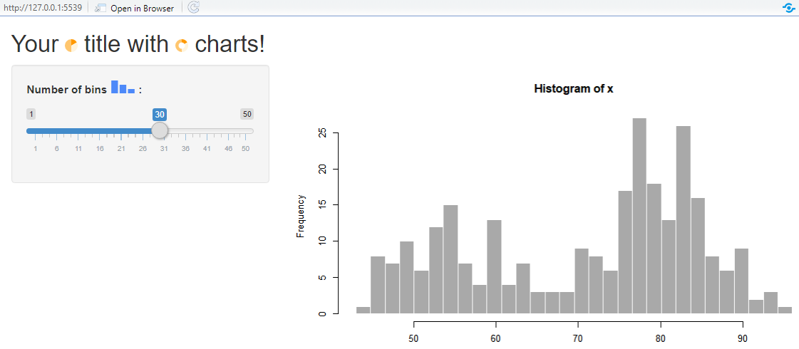
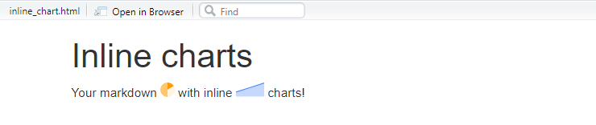

 [](https://github.com/samuelmacedo83/peity/actions)
 [](https://github.com/samuelmacedo83/peity/actions)
 [](https://github.com/samuelmacedo83/peity/actions)

```{r warning = FALSE, include = FALSE}
library(peity)
data <- c(1, 2, 3)
```

# peity

The peity package is a wrapper around [peity.js](https://benpickles.github.io/peity/). It is a `jQuery` plugin that easily converts an element's content into a `svg` mini pie, donut, line or bar chart. It is compatible with any browser that supports `svg`: Chrome, Firefox, IE9+, Opera, Safari.
You can include these charts in your shiny app or in your html document when using rmarkdown.

## Installation

You can install the released version of peity from [CRAN](https://CRAN.R-project.org) with:

```{r eval=FALSE}
install.packages("peity")
```

And the development version from [GitHub](https://github.com/) with:

``` {r eval=FALSE}
# install.packages("devtools")
devtools::install_github("samuelmacedo83/peity")
```

## Example in shiny

Use `peity_p()` to create a `p` tag and include your charts wherever you want in your shiny app. The code below...

```{r eval=FALSE}
library(shiny)

ui <- fluidPage(

    # Charts in your title
    titlePanel(peity_p(
        "Your", pie(c(1,2,3)), "title with ", donut(c(1,2,3)), "charts!"
    )),

    # Sidebar with a slider input for number of bins and a chart
    sidebarLayout(
      sidebarPanel(sliderInput("bins",
        peity_p("Number of bins", bar(c(3,2,1)),":"),
        min = 1, max = 50, value = 30
      )),
      mainPanel(plotOutput("distPlot"))
    )
)

# Define server logic required to draw a histogram
server <- function(input, output) {
    output$distPlot <- renderPlot({
      x <- faithful[, 2]
      bins <- seq(min(x), max(x), length.out = input$bins + 1)
      hist(x, breaks = bins, col = 'darkgray', border = 'white')
    })
}

# Run the application
shinyApp(ui = ui, server = server)

```

... produces this! 



## Example in rmarkdown

You can also use `peity_p()` to include your charts in a `html_document` when using rmarkdown. Create a `.Rmd` file with `output: html_document` and use to produce this.
`` `r knitr::inline_expr('peity_p("Your markdown", pie(c(1,2,3)), "with inline", line(c(1,2,3)), "charts!")')` ``


